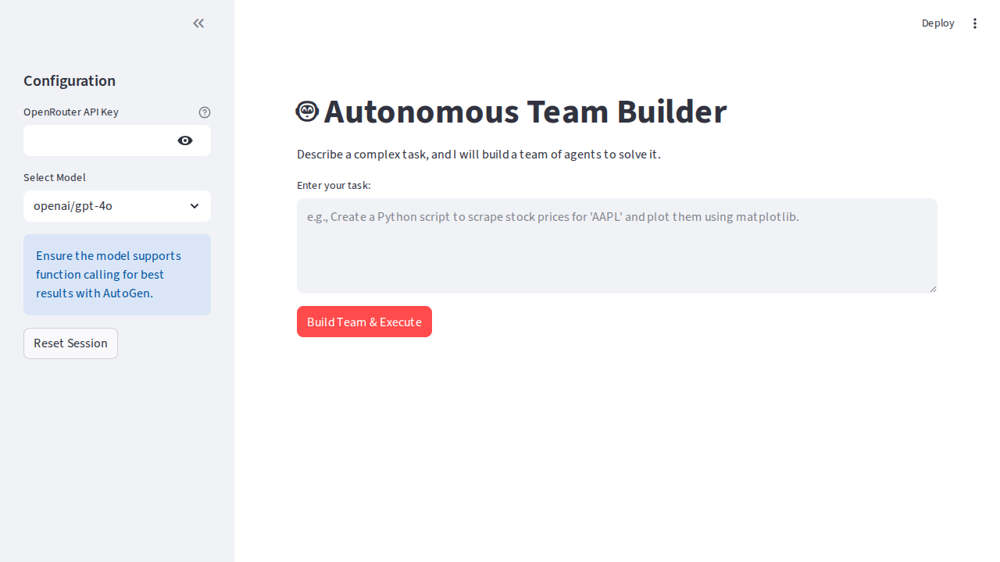

# 🤖 AutoGen AgentBuilder Team



A powerful, containerized Python web application that leverages **Microsoft AutoGen** and **OpenRouter** to autonomously build and orchestrate multi-agent teams. Enter a complex task, and the system will design a team of specialized AI agents to solve it for you.

## 🚀 Features

*   **Autonomous Team Building**: Uses `AgentBuilder` to analyze your task and dynamically instantiate the perfect team of experts.
*   **Real-time Conversation**: Visualize the multi-agent chat as it happens, with a custom-built log capture system that streams stdout to the Streamlit UI.
*   **Model Agnostic**: Compatible with any model on OpenRouter (e.g., GPT-4o, Claude 3.5 Sonnet, Gemini Pro 1.5).
*   **Dockerized**: Fully containerized environment ensuring consistency and easy deployment.
*   **Secure**: API keys are handled securely via session state and temporary configuration files.

## 🛠️ Tech Stack

*   **Frontend**: [Streamlit](https://streamlit.io/)
*   **Agent Framework**: [Microsoft AutoGen](https://microsoft.github.io/autogen/)
*   **LLM Provider**: [OpenRouter](https://openrouter.ai/) (OpenAI API Compatible)
*   **Infrastructure**: Docker & Docker Compose

## 📋 Prerequisites

*   **Docker** and **Docker Compose** installed on your machine.
*   An **OpenRouter API Key** with credits. [Get one here](https://openrouter.ai/keys).

## 🏃‍♂️ Installation & Usage

1.  **Clone the Repository**
    ```bash
    git clone <repository-url>
    cd <repository-directory>
    ```

2.  **Start the Application**
    Run the container using Docker Compose:
    ```bash
    docker-compose up -d
    ```

3.  **Access the Interface**
    Open your browser and navigate to:
    ```
    http://localhost:8501
    ```

4.  **Build Your Team**
    *   Enter your **OpenRouter API Key** in the sidebar.
    *   Select your preferred **LLM Model** (e.g., `openai/gpt-4o` or `anthropic/claude-3.5-sonnet`).
    *   Type a complex task in the main text area (e.g., *"Write a Python script to scrape the latest news about 'AI Agents' and save the headlines to a CSV file."*).
    *   Click **Build Team & Execute**.

## 🏗️ Architecture & Technical Decisions

### The Challenge: Capturing AutoGen Logs
AutoGen streams its agent conversations to `stdout` (the console) by default. Capturing this real-time stream and displaying it in a web interface like Streamlit is non-trivial.

### The Solution: Custom Stdout Redirection
We implemented a robust `StreamlitRedirector` class that acts as a buffer between `sys.stdout` and the Streamlit UI.

1.  **Redirection**: We use `contextlib.redirect_stdout` to route all print statements to our custom class.
2.  **Parsing**: The redirector uses Regex to detect standard AutoGen chat patterns (e.g., `Sender (to Receiver):`).
3.  **Rendering**: When a complete message is detected, it is formatted and rendered immediately using `st.chat_message`, providing a fluid, chat-like experience.
4.  **AgentBuilder Config**: To satisfy `AgentBuilder`'s file-based configuration requirement, the app dynamically generates a temporary `OAI_CONFIG_LIST.json` for each session and cleans it up afterward.

### Directory Structure
```
.
├── app.py                  # Main application logic
├── Dockerfile              # Container definition (Python 3.10-slim + build tools)
├── docker-compose.yml      # Service orchestration
├── requirements.txt        # Python dependencies (pinned for stability)
├── assets/                 # Images and static assets
└── README.md               # Documentation
```

## ⚠️ Notes

*   **Latency**: Initial team building can take 30-60 seconds depending on the complexity of the task.
*   **Model capabilities**: Ensure you select a capable model (like GPT-4 or Claude 3.5) for the best results in code generation and function calling.
